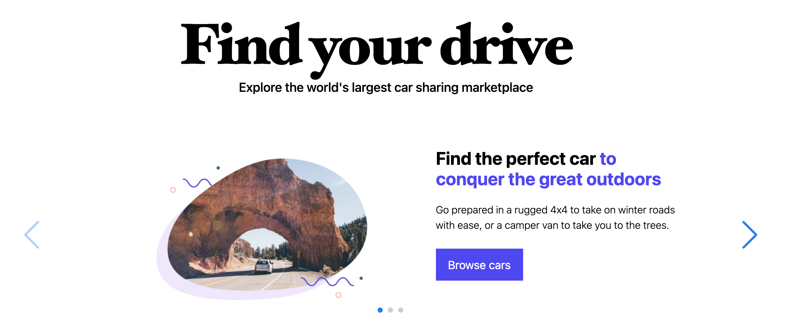

# Carro - Rent the perfect car!

Website: https://carro-carro.herokuapp.com/cars

# Carro is a simple car rental web app made using Ruby on Rails for the back-end and using JS, HTML and SASS for the front-end.

Technologies used:

- Ruby version: 2.6.3
- Rails version: 5.2.6
- Preconfigured authentication with the BCrypt gem
- HTML Layouts developed with Bootstrap 5
- SASS utility classes for alignment, spacing and font size standardization
- JS for implementing complex things on web pages

- System dependencies

- Configuration

- Database creation

- Database initialization

- Services (job queues, cache servers, search engines, etc.)

- Deployment instructions
